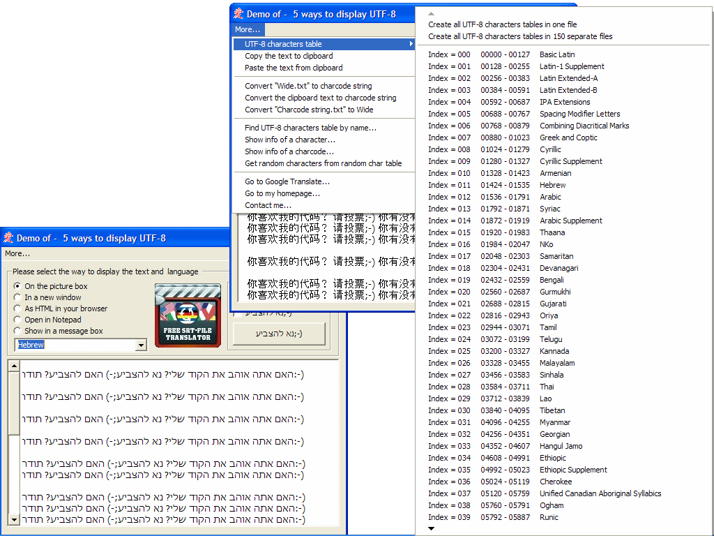



## Five ways to display UTF\-8 without unicode controls \+ all 150 UTF\-8 character code tables

### Description

Five ways of displaying UTF-8 characters without unicode controls. (35Kb Zip)

All 150 UTF-8 character code tables with enum, the name and character code range.

Open/Save files as UTF-8 or ANSI.

Copy and paste unicode text.

Storing UTF-8 without resource file/property page, 50+ different languages stored in the form.

Functions to easily store your own UTF-8 texts.

I'm into an ActiveX control that can quickly translate text, so this feature will hopefully be redundant soon:-)
 
### More Info
 

             |
---                |---
**Submitted On**   |2010-11-17 17:00:02
**By**             |[Jan Andersson](https://github.com/Planet-Source-Code/PSCIndex/blob/master/ByAuthor/jan-andersson.md)
**Level**          |Intermediate
**User Rating**    |4.0 (16 globes from 4 users)
**Compatibility**  |VB 6\.0
**Category**       |[Files/ File Controls/ Input/ Output](https://github.com/Planet-Source-Code/PSCIndex/blob/master/ByCategory/files-file-controls-input-output__1-3.md)
**World**          |[Visual Basic](https://github.com/Planet-Source-Code/PSCIndex/blob/master/ByWorld/visual-basic.md)
**Archive File**   |[Five\_ways\_21930611172010\.zip](https://github.com/Planet-Source-Code/jan-andersson-five-ways-to-display-utf-8-without-unicode-controls-all-150-utf-8-character-__1-73598/archive/master.zip)

